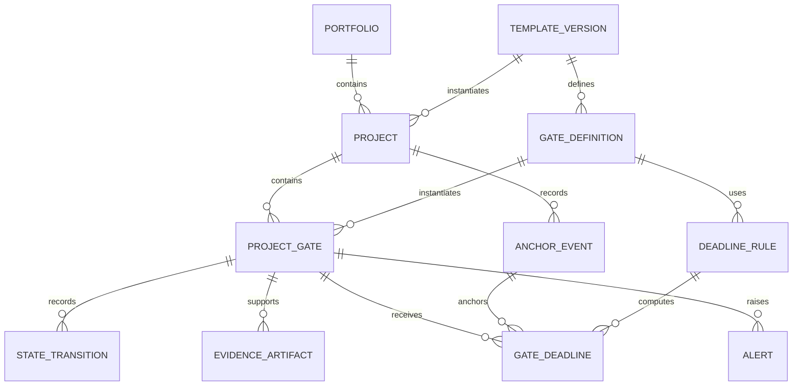

# Conceptual Data Model

## Purpose

The data model treats each compliance obligation as a controlled record with applicability, lifecycle, evidence, deadline, and history. Constraints are enforced near the data so that every reporting and alerting path uses the same rules.

## Entities

| Entity | Purpose | Selected attributes |
|---|---|---|
| `Portfolio` | Groups sanitized concurrent work | `portfolio_id`, `name`, `active_flag` |
| `Project` | Represents one sanitized work instance | `project_id`, `portfolio_id`, `template_version_id`, `status` |
| `TemplateVersion` | Preserves a released gate baseline | `template_version_id`, `version_label`, `effective_date`, `gate_count` |
| `GateDefinition` | Defines a reusable baseline or conditional obligation | `gate_definition_id`, `template_version_id`, `wbs_code`, `phase_band`, `gate_type`, `prime_routing_required`, `time_limited` |
| `ProjectGate` | Instantiates an obligation for a project | `project_gate_id`, `project_id`, `gate_definition_id`, `applicability`, `applicability_reason`, `current_state`, `rejection_count`, `expiry_date` |
| `StateTransition` | Stores immutable lifecycle history | `transition_id`, `project_gate_id`, `from_state`, `to_state`, `event_time`, `owner_role`, `evidence_id` |
| `AnchorEvent` | Records an actual event used by deadline rules | `anchor_event_id`, `project_id`, `anchor_type`, `event_date`, `source_evidence_id` |
| `DeadlineRule` | Defines date derivation | `deadline_rule_id`, `gate_definition_id`, `anchor_type`, `offset_value`, `offset_unit`, `day_basis`, `adjustment_rule` |
| `GateDeadline` | Stores the current derived result and history reference | `gate_deadline_id`, `project_gate_id`, `anchor_event_id`, `deadline_rule_id`, `due_date`, `calculation_status` |
| `EvidenceArtifact` | References a filed artifact without embedding public operational content | `evidence_id`, `project_gate_id`, `artifact_type`, `record_location`, `filed_time`, `content_hash` |
| `Alert` | Records an approaching, breached, missing-anchor, aging, or expiry condition | `alert_id`, `project_gate_id`, `alert_type`, `opened_time`, `resolved_time`, `status` |

## Relationships

## Key constraints

| Constraint | Enforced condition | Reason |
|---|---|---|
| Stable gate identity | A project cannot contain duplicate WBS codes | Preserves unambiguous traceability |
| Template history | A project references one immutable template version | Prevents later template edits from rewriting project history |
| Auditable applicability | `N/A` requires a nonblank reason | Prevents blank fields from being interpreted as decisions |
| Controlled vocabulary | `current_state` must use one of the 11 deployed values | Prevents reporting fragmentation |
| Allowed transition | Each state change must appear in the transition matrix for its gate type | Prevents lifecycle bypass |
| Prime routing | A gate marked as requiring prime review cannot enter `Submitted` without a recorded `Prime Review` cycle | Represents the subcontractor-to-prime boundary |
| Submission evidence | Entry to `Submitted` requires transmission evidence | Separates preparation from delivery |
| Adjudication evidence | Entry to `Rejected` or `Approved` requires government decision evidence | Protects approval metrics |
| Gate-type restriction | Only adjudicated submittal gates may enter `Rejected` or `Approved` | Defines the valid first-pass approval population |
| Rejection accounting | Each transition into `Rejected` increments the rejection counter once | Preserves cure-cycle counts |
| Closure evidence | Entry to `Closed` requires the gate's satisfaction artifact and discharge conditions | Prevents status-only closure |
| Expiry control | `Expiring` and `Expired` require `time_limited = true` and a recorded expiry date | Prevents invalid decay states |
| Anchor requirement | A derived due date cannot exist without the required anchor event | Enforces no anchor, no clock |
| Derived-date provenance | Each due date retains its anchor, rule, calendar basis, and calculation version | Makes recomputation auditable |
| Evidence immutability | Filed evidence references and state transitions are append-only | Preserves the audit trail |

## Database invariants

Database constraints, checks, foreign keys, and transactional transition procedures enforce the rules that define record validity. The application may guide the user, but it cannot commit a record that violates the model.

The first-pass approval population is enforced through gate type and permitted state transitions. An administrative gate cannot enter `Rejected` or `Approved`. A reporting query can therefore select adjudicated rows without reconstructing intent from labels or document names.

The `N/A` rule is also an invariant. A transaction that sets a gate to `N/A` must write a reason in the same commit. Expiry transitions require both a time-limited gate type and a valid expiry date.

Deadline creation follows the same pattern. A `GateDeadline` with status `COMPUTED` must reference a matching `AnchorEvent` and `DeadlineRule`. Missing anchors produce an explicit `UNANCHORED` calculation status with a null due date.

## Transaction boundaries

A lifecycle change, supporting evidence reference, counter update, and audit entry commit in one transaction. A failed component rolls back the entire change. This prevents a current state from diverging from its evidence or transition history.

When an anchor moves, the anchor revision and all affected derived deadlines commit as one controlled change set. Previous values remain available in history. Alerts are recalculated from the committed dates.

## Database enforcement and application logic

| Concern | Database invariant | Application-only rule |
|---|---|---|
| Consistency across tools | Applies to every writer and import path | Applies only to paths that call the rule correctly |
| Concurrent updates | Evaluated inside the transaction | Can use stale values between read and write |
| Auditability | Rejection and constraint failure occur at the authoritative record | Depends on application logging coverage |
| Metric validity | Gate type and transition eligibility remain part of stored structure | Reporting code may recreate populations differently |
| Failure mode | Invalid transaction is rejected | Invalid data may persist after a bypass or defect |
| User guidance | Limited to clear constraint errors | Can provide richer prompts and previews |

Application logic remains useful for forms, explanations, forecasts, and user feedback. Record-validity rules belong in the database because they must survive interface changes, bulk imports, and multiple clients.

## Public-artifact boundary

This conceptual schema omits operational identifiers and stored content. Evidence artifacts are represented as references and metadata. The public repository contains no document bodies, correspondence, forms, reviewer comments, or record locations that could identify a project.
