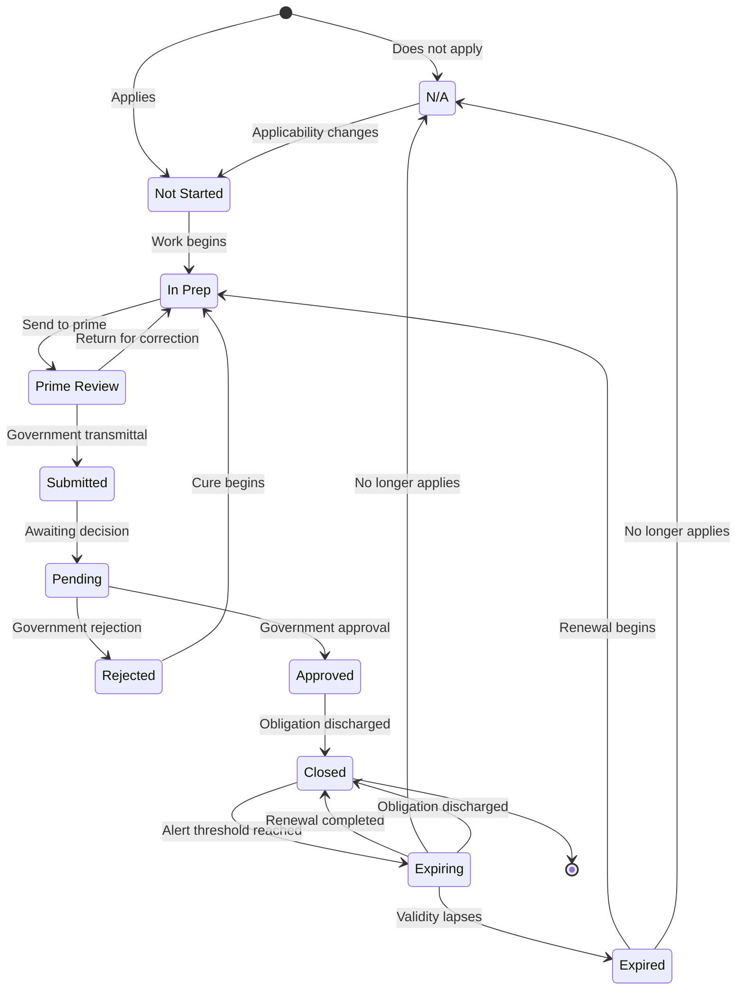

# Submittal Lifecycle Model

## Purpose

This lifecycle model represents the status of government-facing obligations tracked for a small subcontractor performing federal construction task orders at an overseas installation. It records contractor preparation, subcontractor-to-prime routing, government adjudication, closure, and renewal of time-limited approvals.

The model uses the 11 states implemented in the deployed instrument. A status change requires dated evidence in the record system. Elapsed time and alerts do not replace lifecycle states.

## State definitions

| State | Definition | Entry condition | Exit condition | Transition owner |
|---|---|---|---|---|
| `N/A` | The gate does not apply to the project. | Applicability review determines that the gate is outside the project's obligations, and the reason is recorded. | A documented change makes the gate applicable, or the project closes with the recorded reason unchanged. | Contractor |
| `Not Started` | The gate applies, but work has not begun. | The gate is instantiated and confirmed as applicable. | Preparation begins. | Contractor |
| `In Prep` | The contractor is preparing the required artifact or renewal package. | Work begins, or a rejected or expired item enters a cure or renewal cycle. | The artifact is ready for prime-contractor review. | Contractor |
| `Prime Review` | The artifact is with the prime contractor for review or signature before government submission. | The contractor sends the prepared artifact to the prime contractor with transmission evidence. | The prime contractor authorizes or completes government submission, or returns the artifact for correction. | Contractor through its contractual routing process |
| `Submitted` | The artifact has been transmitted to the government. | Government transmission is recorded with evidence. | The item is recorded as awaiting a government decision. | Contractor |
| `Pending` | The artifact is with the government awaiting a decision. | Government receipt or review status establishes that the item is awaiting adjudication. | The government approves or rejects the item. | Government |
| `Rejected` | The government returned the artifact with comments. | A government rejection or disapproval is received and filed. | The contractor begins the cure cycle, returns the item to `In Prep`, and increments the rejection counter. | Government for the rejection; contractor for cure initiation |
| `Approved` | Government approval has been received. | The approval artifact is received and filed. | The obligation is closed after its filing and discharge conditions are met. | Government |
| `Closed` | The obligation is discharged and the required evidence is filed. | All satisfaction and filing conditions for the gate are met. | The state remains terminal for ordinary gates. A time-limited approval moves to `Expiring` when its warning threshold is reached. | Contractor for entry; time-driven for an expiry transition |
| `Expiring` | A time-limited approval is approaching its recorded expiry date. | The configured alert threshold is reached while a closed approval remains valid. | The renewal is completed, the gate is set to `N/A` with a reason, or the approval reaches its expiry date. | Time-driven |
| `Expired` | A time-limited approval has lapsed and requires renewal. | The recorded expiry date passes without accepted renewal evidence. | Renewal work begins and the item returns to `In Prep`, or the gate is changed to `N/A` with a recorded reason. | Time-driven for entry; contractor for renewal initiation |

## Distinctive model features

### Prime-contractor review

`Prime Review` records the routing boundary between the subcontractor and the prime contractor. It prevents internal completion from being reported as government submission. It also identifies delay that occurs before an obligation reaches the government.

### Time-limited approvals

`Expiring` and `Expired` model approvals as assets whose validity can decay. Permits, access passes, and recurring certifications can be approved at one point and later require renewal. The model therefore separates approval from continuing validity.

## State transition table

| Current state | Event or condition | Next state | Owner | Required evidence or control |
|---|---|---|---|---|
| New gate | Applicability confirmed | `Not Started` | Contractor | Source obligation and applicability record |
| New gate | Gate does not apply | `N/A` | Contractor | Recorded reason |
| `N/A` | Documented change makes the gate applicable | `Not Started` | Contractor | Change basis and applicability revision |
| `Not Started` | Preparation begins | `In Prep` | Contractor | Assignment or work-start record |
| `In Prep` | Package sent for prime review or signature | `Prime Review` | Contractor | Prime-routing evidence |
| `Prime Review` | Package returned for correction before government submission | `In Prep` | Contractor | Return record and correction basis |
| `Prime Review` | Package transmitted to the government | `Submitted` | Contractor | Government transmittal evidence |
| `Submitted` | Government receipt or awaiting-decision status recorded | `Pending` | Government | Receipt, acknowledgment, or equivalent status evidence |
| `Pending` | Government rejects the package | `Rejected` | Government | Filed rejection artifact |
| `Rejected` | Cure work begins | `In Prep` | Contractor | Rejection counter increment and cure assignment |
| `Pending` | Government approves the package | `Approved` | Government | Filed approval artifact |
| `Approved` | Discharge and filing conditions are met | `Closed` | Contractor | Gate-satisfaction evidence |
| `Closed` | Expiry alert threshold is reached for a time-limited approval | `Expiring` | Time-driven | Recorded expiry date and configured threshold |
| `Expiring` | Renewal is completed before expiry | `Closed` | Contractor or government, according to gate type | Filed renewal evidence |
| `Expiring` | Expiry date passes without accepted renewal | `Expired` | Time-driven | Date comparison and absence of renewal evidence |
| `Expiring` | Approval is no longer required | `N/A` or `Closed` | Contractor | Recorded applicability or discharge basis |
| `Expired` | Renewal preparation begins | `In Prep` | Contractor | Renewal assignment and retained expiry history |
| `Expired` | Gate no longer applies | `N/A` | Contractor | Recorded reason |

## State diagram

## Guard conditions

| Transition | Guard condition |
|---|---|
| New gate to `N/A` | A reason is present. A blank applicability decision is not auditable. |
| `Not Started` to `In Prep` | The gate applies and responsibility for preparation has been assigned or work has begun. |
| `In Prep` to `Prime Review` | A reviewable artifact exists and transmission to the prime contractor is recorded. |
| `Prime Review` to `Submitted` | Government transmittal evidence exists. Prime review alone does not satisfy this guard. |
| `Submitted` to `Pending` | Evidence shows that the item is with the government awaiting decision. |
| `Pending` to `Rejected` | A government rejection artifact exists. |
| `Rejected` to `In Prep` | The rejection counter increments and the cure cycle retains the prior submission history. |
| `Pending` to `Approved` | A government approval artifact exists. |
| `Approved` to `Closed` | The obligation is discharged and all required evidence is filed. |
| `Closed` to `Expiring` | The approval is time-limited, has a recorded expiry date, and has reached the configured warning threshold. |
| `Expiring` to `Expired` | The expiry date has passed and no accepted renewal evidence exists. |
| Any applicable state to `N/A` | A documented change establishes that the gate no longer applies, and a reason is recorded. |

## Illegal transitions

The following transitions are prohibited because they bypass required evidence or ownership boundaries:

- `Not Started` to `Submitted`, because preparation and prime-contractor routing are unrecorded.
- `In Prep` to `Submitted`, because `Prime Review` is required for the subcontractor-to-prime submission route.
- `Prime Review` to `Pending`, because government transmittal must first be recorded as `Submitted`.
- `Submitted` to `Approved` or `Rejected`, because the item must first be recognized as `Pending` with the government.
- `Rejected` to `Approved`, because the cure, prime-review, resubmission, and pending-decision cycle has not occurred.
- `Pending` to `Closed`, because government approval evidence is absent.
- `Closed` directly to `Expired`, because the `Expiring` control must surface the approaching lapse.
- Any state to `N/A` without a recorded reason.
- Any ordinary transition out of `Closed` except the time-driven `Closed` to `Expiring` transition for a time-limited approval. A later unrelated requirement is represented as a new obligation instance or a formally documented reopening.

## Aging and counters

Prolonged delay is an aging condition on `Submitted` or `Pending`. It is not a separate lifecycle state. Alerts use elapsed time and applicable deadline rules to surface stalled obligations without changing the recorded owner or adjudication status.

Each government rejection increments a rejection counter. The cure loop is `Rejected` to `In Prep` to `Prime Review` to `Submitted` to `Pending`. Prior submissions, decisions, and evidence remain immutable so the instrument preserves the complete adjudication history.

## Administrative-gate path

Non-adjudicated administrative gates follow `Not Started` to `In Prep` to `Prime Review`, where prime routing is required, to `Submitted` to `Pending` to `Closed`. `Rejected` and `Approved` are prohibited for these gates. An administrative item returned by its recipient moves to `In Prep` without incrementing the government-rejection counter.

Any administrative gate may enter `N/A` before submission when a reason is recorded. A time-limited administrative approval may follow `Closed` to `Expiring` to `Expired` to `In Prep` for renewal. These restrictions keep administrative rows outside the first-pass approval denominator.

## Sanitization

This public model omits project identifiers, task order numbers, contract numbers, contractor and government personnel names, installation and country names, unit designations, dollar values, and identifying project dates. It contains no controlled unclassified information, government forms, reviewer comments, or correspondence.
